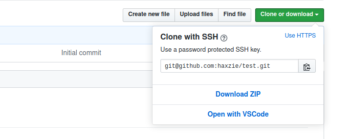

<center>
<h1 align="center">Open With Visual Studio Code</h1>
<p align="center">FireFox plugin and connector to open any GitHub repository directly from the browser</p>
</center>



**Note: The application is in it's early stages and may be highly unstable. Currently we only support Linux/MacOS.**

This repository contains two components of the application

- A native connector app
- FireFox AddOn

## Installation

1. Install the connector to your machine
```bash
npm i -g open-with-vscode
```
2. Install the [FireFox AddOn](https://addons.mozilla.org/en-US/firefox/addon/open-with-vscode) to your browser

After installing both the Connector and the addon, simply go to any repository on GitHub, click on `clone or download`, you will be able to see the `Open with VSCode` button.

By Default, the connector clones the repositories to `~/github-projects` directory within your system. Once the repository is already cloned, you can simply use the same button to open the repository using VSCode without any cloning.

## Setting up the project for development

Make sure you have the following requirements installed/setup in your system

- Latest version of FireFox
- Latest version of Node.js and NPM
- Git installed and configured
- GitHub account and your local machine is setup with [SSH keys to your GitHub account](https://help.github.com/en/enterprise/2.15/user/articles/adding-a-new-ssh-key-to-your-github-account)

### Clone the project to your local machine

```bash
git clone https://github.com/haxzie/open-with-vscode
```

### Install the connector

cd into `packages/connector` and execute the following command to install the connector globally

```bash
npm link
```

#### For development 
> The connector will automatically install the necessary `native manifest` to `.mozilla/native-messaging-hosts` in your `home` directory. If you want to run the connector from the source, edit the `.mozilla/native-messaging-hosts/open_with_vscode.json` file and add the following contents by replacing the path property with the index.js file of the connector.

```javascript
{
    "name": "open_with_vscode",
    "description": "Host for executing git commads",
    "path": "<PATH to the index.js file of the connector>",
    "type": "stdio",
    "allowed_extensions": ["open-with-vscode@haxzie.com"],
}
```

### Install the dependencies for the plugin

cd into the `packages/plugin` directory and execute the following command.

```bash
npm install
```

### Bundling the plugin

```bash
npm run build
```

## Run the plugin on the browser
Use the following command to spin up an instance of FireFox with the plugin installed temporarily.
```bash
npm start
```

Or, if you want to manually install the plugin. Open your browser, and on the addressbar goto [debugging menu](about:debugging#/runtime/this-firefox), or simply type `about:debugging#/runtime/this-firefox` in your address bar.

Click on **Load Temporary Extension**, Browse the plugin directory of the project, select `dist/content-script.js`. This will temporarily install the AddOn to your browser. For logs, click on the `inspect` button to open the console fro the background-scripts of the plugin.